# FamilyChat 操作手册

> **版本：** v2.0.0  
> **最后更新：** 2025年6月  
> **适用平台：** Web（支持移动端自适应）

---

## 目录

1. [产品简介](#1-产品简介)
2. [账号注册与登录](#2-账号注册与登录)
3. [主页界面概览](#3-主页界面概览)
4. [消息列表](#4-消息列表)
5. [聊天功能](#5-聊天功能)
6. [通讯录](#6-通讯录)
7. [个人中心](#7-个人中心)
8. [朋友圈](#8-朋友圈)
9. [搜索功能](#9-搜索功能)
10. [设置与偏好](#10-设置与偏好)
11. [AI 模型配置](#11-ai-模型配置)
12. [炼化数字人](#12-炼化数字人)
13. [收藏功能](#13-收藏功能)
14. [红包功能](#14-红包功能)
15. [系统统计与备份](#15-系统统计与备份)
16. [深色模式](#16-深色模式)
17. [我的数字人](#17-我的数字人)
18. [语音音色管理](#18-语音音色管理)

---

## 1. 产品简介

**FamilyChat** 是一款专为家庭设计的数字人聊天应用，采用微信风格界面，支持：

- 💬 **即时通讯** — 文字、语音、图片、文件消息
- 🤖 **AI 数字人** — 可自定义性格的家庭 AI 助手
- 📷 **朋友圈** — 分享家庭生活动态
- 🧧 **红包** — 家庭互动红包
- ⭐ **收藏** — 保存重要内容
- 🔍 **搜索** — 全局搜索联系人、群组和聊天记录
- 🌙 **深色模式** — 护眼暗色主题

---

## 2. 账号注册与登录

### 2.1 登录页面

首次打开应用会看到登录页面，顶部显示应用 Logo（🏠）和名称。

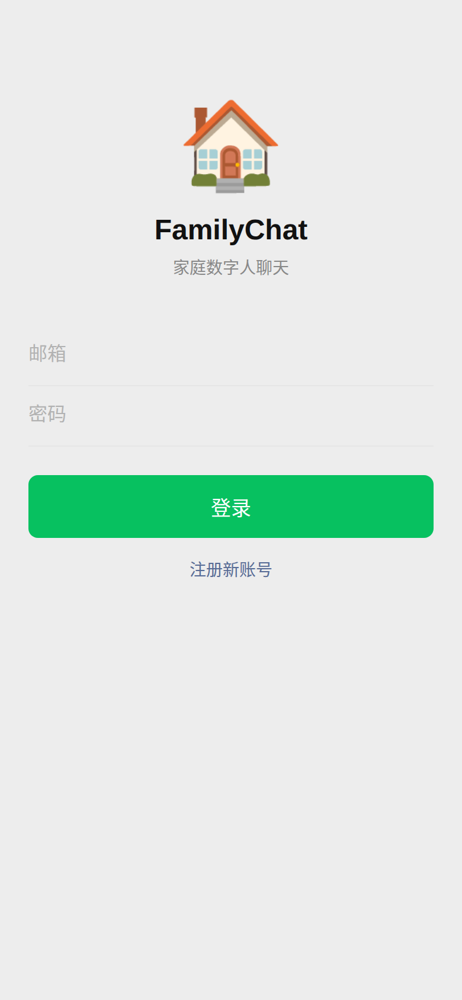

**操作步骤：**
1. 输入你的 **邮箱地址**
2. 输入 **密码**
3. 点击 **「登录」** 按钮

> 💡 如果已有账号，直接登录即可。首次使用需要先注册。

### 2.2 注册新账号

点击登录页面底部的 **「注册新账号」** 链接，切换到注册模式。

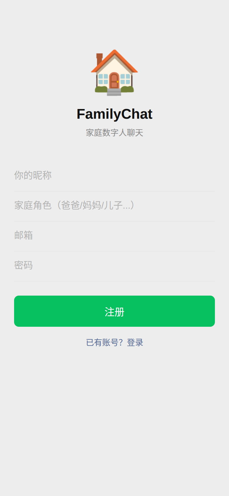

**注册需要填写：**
| 字段 | 说明 | 必填 |
|------|------|------|
| 昵称 | 你在家庭群中显示的名字 | ✅ |
| 家庭角色 | 如：爸爸、妈妈、儿子、女儿等 | ❌ |
| 邮箱 | 用于登录的邮箱地址 | ✅ |
| 密码 | 登录密码 | ✅ |

填写完成后点击 **「注册」** 按钮。注册成功后会自动进入主界面。

> 💡 注册后可以随时在「设置 → 编辑资料」中修改昵称和角色信息。

---

## 3. 主页界面概览

登录成功后进入主界面，整体布局与微信一致：

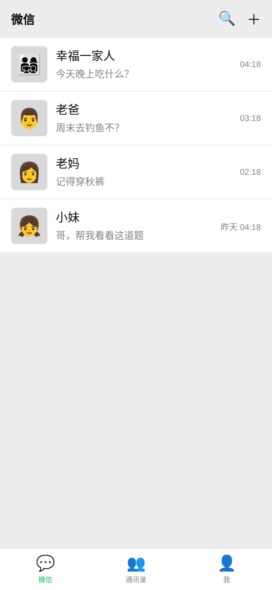

### 界面布局说明

| 区域 | 位置 | 功能 |
|------|------|------|
| **顶部标题栏** | 最上方 | 显示「微信」标题，右侧有 🔍 搜索和 ＋ 创建群聊按钮 |
| **内容区域** | 中间 | 显示当前 Tab 的内容（消息列表/通讯录/个人中心） |
| **底部导航栏** | 最下方 | 三个 Tab 切换：💬 微信、👥 通讯录、👤 我 |

### 底部导航栏

- **💬 微信** — 消息列表，显示所有聊天会话
- **👥 通讯录** — 查看 AI 数字人和好友列表
- **👤 我** — 个人中心，包含朋友圈、设置等功能

---

## 4. 消息列表

消息列表页显示所有聊天会话，每个会话项包含：

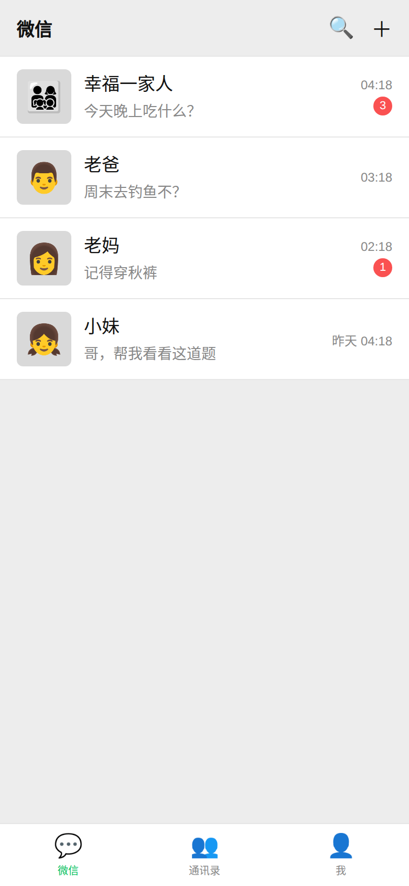

### 会话项信息

| 元素 | 说明 |
|------|------|
| **头像** | 左侧显示群聊/联系人头像（支持 emoji 或图片） |
| **名称** | 群聊名称或联系人昵称 |
| **最后消息** | 最近一条消息的预览文本 |
| **时间** | 消息发送时间（今天显示时分，昨天显示「昨天」，更早显示日期） |
| **未读角标** | 红色数字角标，表示未读消息数量 |

### 操作

- **点击会话项** → 进入聊天页面
- **点击右上角 🔍** → 进入搜索页面
- **点击右上角 ＋** → 创建新群聊

---

## 5. 聊天功能

### 5.1 聊天界面

点击任意会话进入聊天页面：

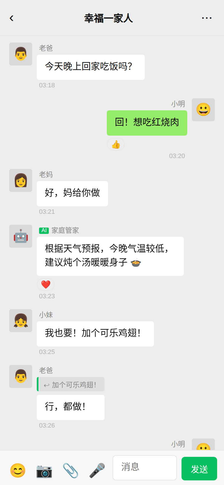

### 界面元素说明

| 区域 | 说明 |
|------|------|
| **顶部导航栏** | 显示群聊名称，左侧返回按钮 ‹，右侧菜单按钮 ⋯ |
| **消息区域** | 中间滚动区域，显示所有聊天消息 |
| **输入区域** | 底部工具栏，包含表情、图片、文件、语音等按钮和输入框 |

### 消息类型

聊天支持以下消息类型：

#### 📝 文字消息
- 自己发送的消息显示在 **右侧**（绿色气泡）
- 他人发送的消息显示在 **左侧**（白色气泡）
- AI 数字人的消息带有 **「AI」** 标签

#### 🖼️ 图片消息
- 点击可全屏查看
- 支持发送本地图片

#### 🎤 语音消息
- 带有声波动画效果
- 点击即可播放

#### 📄 文件消息
- 显示文件图标、文件名和文件大小

#### 🧧 红包消息
- 金色渐变卡片样式
- 显示祝福语

#### ↩️ 引用回复
- 消息气泡上方显示被引用的消息摘要
- 点击可跳转到原消息位置

#### 😀 表情回应（Reactions）
- 消息下方显示表情回应
- 点击表情可添加/取消回应

#### 📌 系统消息
- 居中灰色显示，如「xxx 加入了群聊」

### 5.2 发送消息

#### 发送文字
1. 在底部输入框中输入文字
2. 点击 **「发送」** 按钮或按 **Enter 键** 发送
3. **Shift + Enter** 可换行

#### 发送图片
1. 点击输入栏左侧的 📷 按钮
2. 从文件选择器中选择图片
3. 图片会自动上传并发送

#### 发送文件
1. 点击输入栏左侧的 📎 按钮
2. 选择要发送的文件
3. 文件会自动上传并发送

#### 发送语音
1. 点击 🎤 按钮切换到语音模式
2. 输入框变为 **「按住 说话」** 按钮
3. 按住按钮开始录音，松开结束并发送

> 💡 再次点击 🎤 按钮可切回文字输入模式。

### 5.3 表情面板

点击输入栏左侧的 😊 按钮打开表情面板：

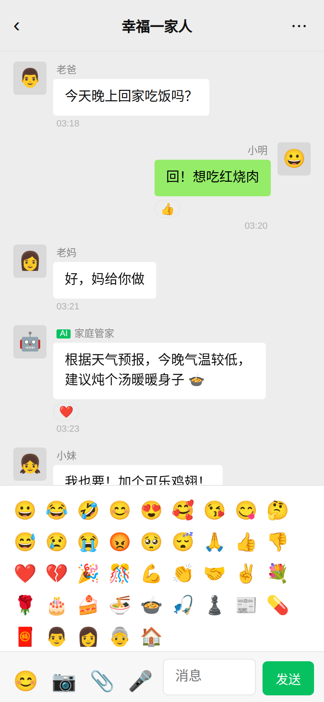

表情面板包含 38 个常用 emoji 表情，点击即可插入到输入框中。

### 5.4 消息操作菜单

**长按/右键点击** 消息气泡，会弹出操作菜单：

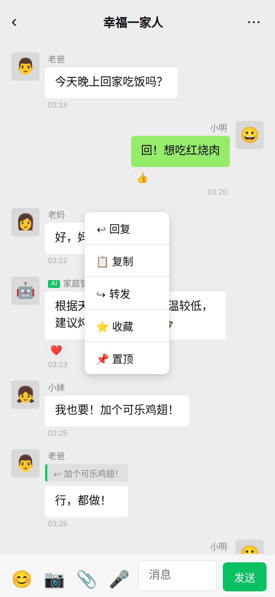

| 操作 | 说明 |
|------|------|
| ↩ **回复** | 引用该消息进行回复 |
| 📋 **复制** | 复制消息文本到剪贴板 |
| ↪ **转发** | 将消息转发到其他群聊 |
| ⭐ **收藏** | 将消息添加到收藏 |
| 📌 **置顶** | 将消息设为群置顶 |
| 🗑️ **撤回** | 撤回自己发送的消息（仅限自己的消息） |

### 5.5 群成员查看

点击聊天页面右上角的 **⋯** 按钮，可查看群成员列表：

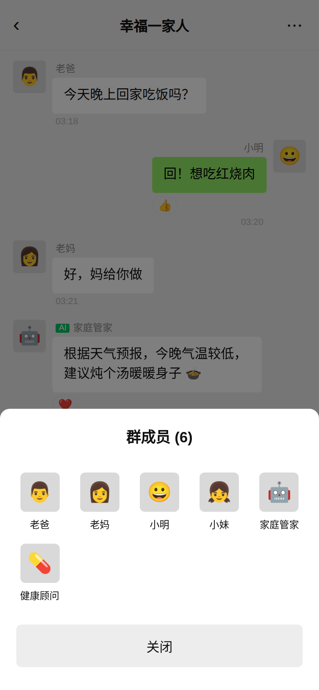

- 以 5 列网格展示所有群成员头像和昵称
- AI 数字人成员会显示在列表中

### 5.6 置顶消息

在消息操作菜单中选择「置顶」，可将重要消息置顶。点击群信息中的「📌 置顶消息」可查看所有置顶内容：

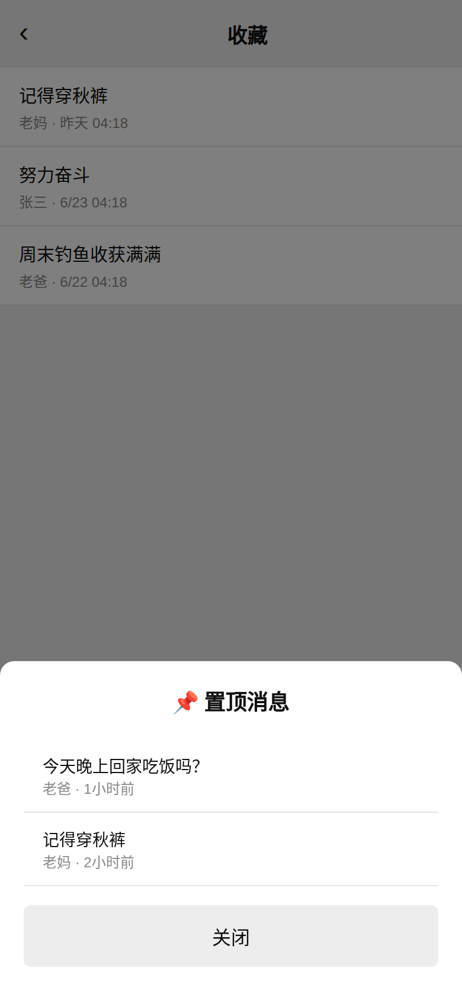

---

## 6. 通讯录

点击底部导航栏的 **👥 通讯录** Tab：

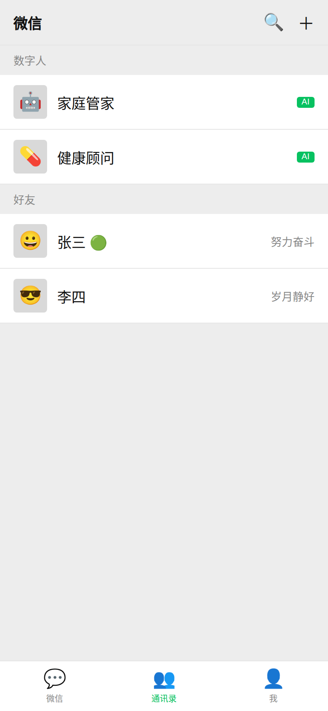

### 通讯录结构

通讯录分为以下区域：

| 区域 | 说明 |
|------|------|
| **数字人** | 显示所有 AI 数字人联系人，带有绿色「AI」标签 |
| **好友** | 显示所有真人好友，右侧显示在线状态（🟢 在线） |
| **新的好友请求** | 如有待处理的好友请求，会在此显示（可接受/拒绝） |

### 操作

- **点击数字人** → 查看数字人详情
- **点击好友** → 查看好友资料
- **接受好友请求** → 点击请求项右侧的「接受」按钮

---

## 7. 个人中心

点击底部导航栏的 **👤 我** Tab：

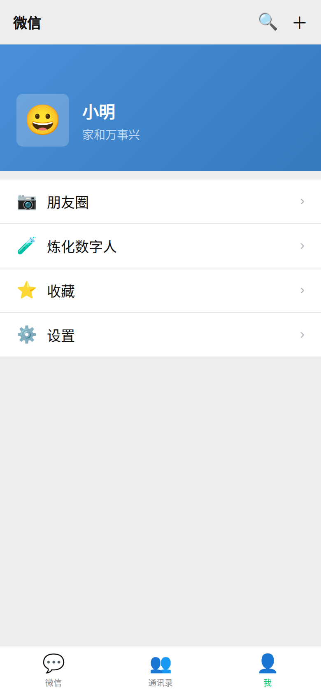

### 个人信息区域

顶部显示蓝色渐变背景的个人信息卡片：
- **头像** — 你的个人头像（emoji 或图片）
- **昵称** — 你的显示名称
- **签名** — 个性签名

### 功能入口

| 入口 | 说明 |
|------|------|
| 📷 **朋友圈** | 进入朋友圈查看/发布动态 |
| 🧪 **炼化数字人** | 用聊天记录训练 AI 数字人的性格 |
| ⭐ **收藏** | 查看已收藏的消息内容 |
| ⚙️ **设置** | 进入设置页面 |

---

## 8. 朋友圈

### 8.1 查看朋友圈

从个人中心点击 **「朋友圈」** 进入：

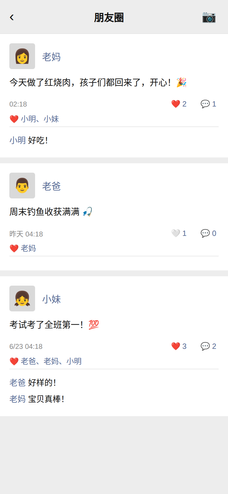

### 动态卡片信息

每条动态包含：

| 元素 | 说明 |
|------|------|
| **头像 + 昵称** | 发布者的头像和名称 |
| **文字内容** | 动态的文字内容 |
| **图片** | 如有附带图片，以网格形式展示 |
| **时间** | 发布时间 |
| **点赞** | 显示点赞人数和名单，❤️ 表示已点赞 |
| **评论** | 显示评论内容 |

### 互动操作

- **🤍/❤️** — 点赞/取消点赞
- **💬** — 评论（弹出输入框）

### 8.2 发布朋友圈

点击朋友圈页面右上角的 📷 按钮：

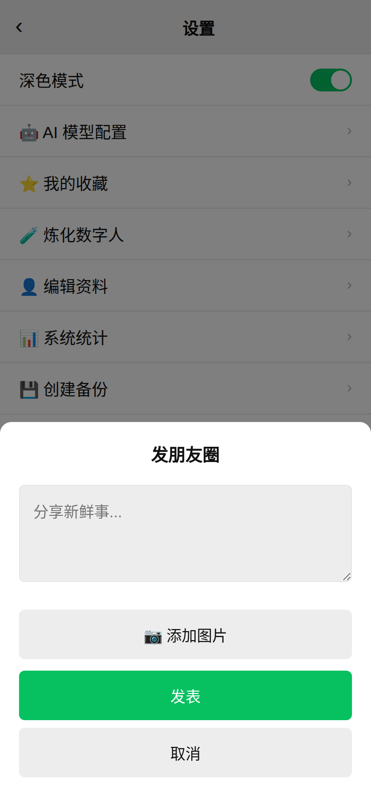

**发布步骤：**
1. 在文本框中输入想要分享的内容
2. 点击 **「📷 添加图片」** 选择图片（可选，支持多张）
3. 预览图片缩略图会显示在下方
4. 点击 **「发表」** 发布动态

---

## 9. 搜索功能

点击主页右上角的 🔍 按钮进入搜索页面：

### 搜索范围

搜索功能支持全局搜索，结果分为三类：

| 类别 | 说明 |
|------|------|
| **联系人** | 匹配昵称的联系人 |
| **群组** | 匹配名称的群聊 |
| **聊天记录** | 匹配消息内容的聊天记录，显示发送者、群名和时间 |

### 操作

- 输入关键词后自动搜索（300ms 防抖）
- 点击搜索结果中的群组或聊天记录 → 跳转到对应聊天
- 点击 **「取消」** 返回上一页

---

## 10. 设置与偏好

从个人中心点击 **「设置」** 进入设置页面：

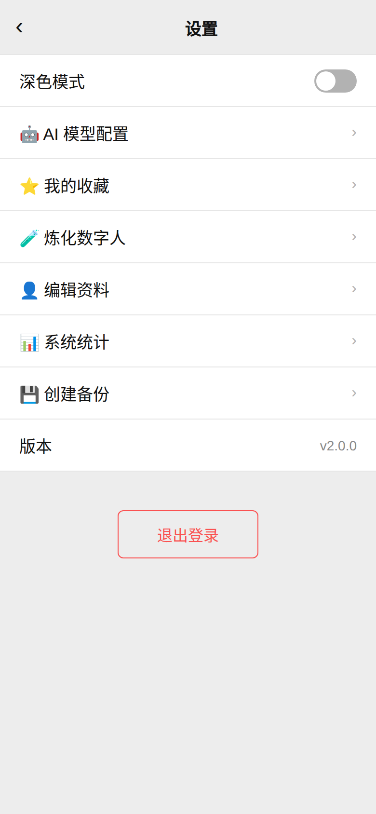

### 设置项说明

| 设置项 | 说明 |
|------|------|
| **🌙 深色模式** | 开关切换深色/浅色主题 |
| **🤖 AI 模型配置** | 配置 AI 数字人使用的模型和 API |
| **⭐ 我的收藏** | 查看收藏的消息内容 |
| **🧪 炼化数字人** | 用文本训练数字人性格 |
| **👤 编辑资料** | 修改昵称、签名、性别、地区 |
| **📊 系统统计** | 查看系统数据统计 |
| **💾 创建备份** | 创建系统数据备份 |
| **版本** | 显示当前版本号（v2.0.0） |
| **退出登录** | 退出当前账号 |

---

## 11. AI 模型配置

从设置页面点击 **「🤖 AI 模型配置」**：

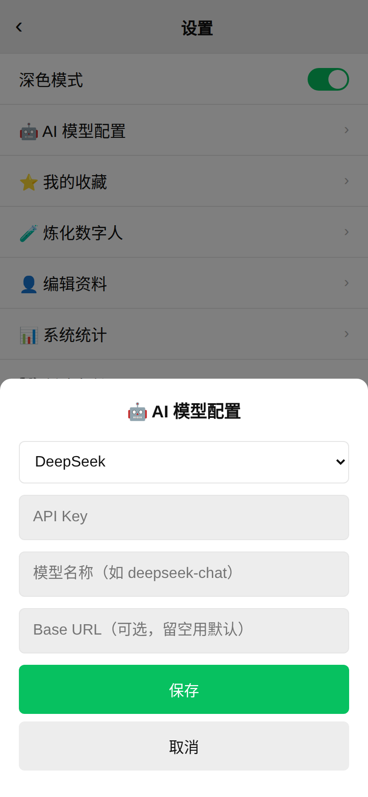

### 支持的 AI 提供商

| 提供商 | 说明 |
|------|------|
| **DeepSeek** | DeepSeek AI 模型 |
| **OpenAI** | GPT 系列模型 |
| **智谱AI** | 智谱 GLM 系列 |
| **通义千问** | 阿里通义千问 |
| **本地模型** | 自建本地模型服务 |

### 配置步骤

1. 选择 **AI 提供商**
2. 输入 **API Key**
3. 输入 **模型名称**（如 `deepseek-chat`）
4. 如需自定义接口地址，填写 **Base URL**（可选）
5. 点击 **「保存」**

---

## 12. 炼化数字人

「炼化」功能可以让你通过聊天记录或自我介绍来训练 AI 数字人的性格特征。

从设置页面或个人中心点击 **「🧪 炼化数字人」**：

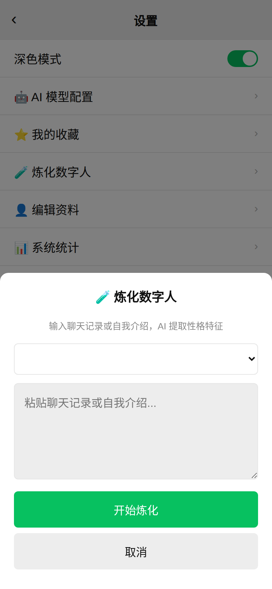

### 操作步骤

1. **选择数字人** — 从下拉列表中选择要炼化的 AI 数字人
2. **输入内容** — 粘贴聊天记录或自我介绍文本
3. **点击「开始炼化」** — AI 会分析文本并提取性格特征

> 💡 炼化内容越丰富，数字人的性格特征越准确。建议提供多段对话记录。

---

## 13. 收藏功能

### 查看收藏

从个人中心点击 **「⭐ 收藏」** 或从设置页面进入：

### 收藏来源

- 在聊天中通过消息菜单的 **「⭐ 收藏」** 添加
- 支持收藏文字、图片等不同类型的消息
- 显示来源发送者和收藏时间

---

## 14. 红包功能

在聊天中点击输入栏区域可以发送红包：

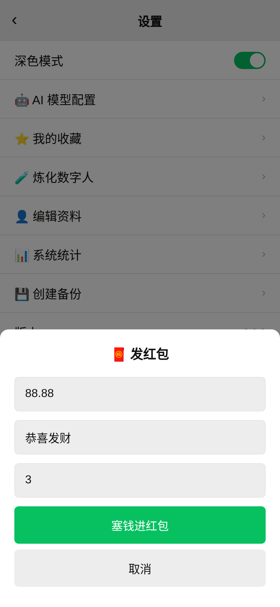

### 发红包步骤

1. 输入 **金额**（元，最多 200 元）
2. 输入 **祝福语**（默认「恭喜发财」）
3. 设置 **红包个数**（支持拼手气红包）
4. 点击 **「塞钱进红包」** 发出

### 收到红包

- 红包消息显示为金色渐变卡片
- 显示祝福语和红包图标
- 点击红包可拆开

---

## 15. 系统统计与备份

### 系统统计

从设置页面点击 **「📊 系统统计」**：

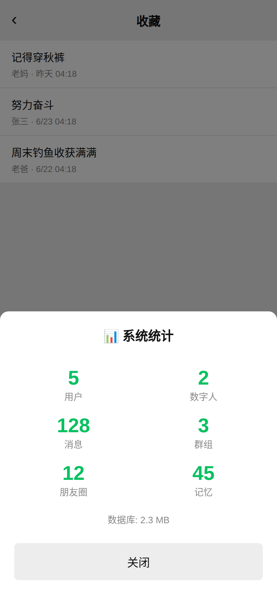

统计信息包括：
- 👥 用户总数
- 🤖 数字人总数
- 💬 消息总数
- 👨‍👩‍👧‍👦 群组总数
- 📷 朋友圈动态数
- 🧠 记忆条数
- 💾 数据库大小

### 创建备份

从设置页面点击 **「💾 创建备份」**，系统会创建一份完整的数据备份。

---

## 16. 深色模式

从设置页面点击 **「深色模式」** 开关：

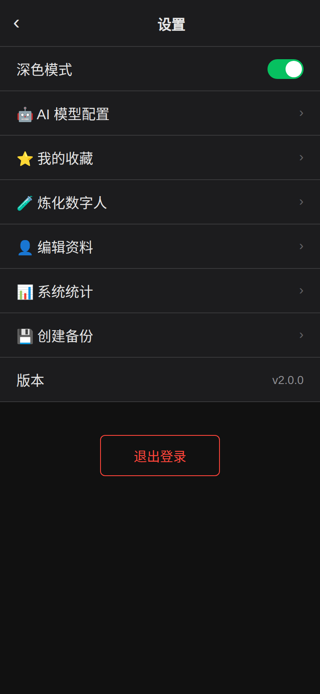

深色模式特点：
- 背景色变为深黑色
- 文字颜色自动调整为浅色
- 所有组件（聊天气泡、卡片、输入框等）同步适配
- 设置会自动保存，下次打开时保持

---

## 附录：快捷操作汇总

| 操作 | 方式 |
|------|------|
| 发送消息 | Enter 键 |
| 换行 | Shift + Enter |
| 回复消息 | 右键/长按消息 → 回复 |
| 复制消息 | 右键/长按消息 → 复制 |
| 转发消息 | 右键/长按消息 → 转发 |
| 收藏消息 | 右键/长按消息 → 收藏 |
| 撤回消息 | 右键/长按自己的消息 → 撤回 |
| 置顶消息 | 右键/长按消息 → 置顶 |
| 发送图片 | 点击 📷 按钮 |
| 发送文件 | 点击 📎 按钮 |
| 发送语音 | 点击 🎤 → 按住说话 |
| 插入表情 | 点击 😊 按钮 |
| 搜索 | 主页右上角 🔍 |
| 创建群聊 | 主页右上角 ＋ |

---

## 常见问题

### Q: 忘记密码怎么办？
A: 当前版本暂不支持密码重置功能，请联系系统管理员。

### Q: 如何添加好友？
A: 当前版本的好友添加需要通过系统管理员或群内互动完成。

### Q: 数字人不回复怎么办？
A: 请检查「设置 → AI 模型配置」中的 API Key 是否正确配置。

### Q: 语音消息无法录制？
A: 浏览器需要授予麦克风权限。请在浏览器设置中允许网站使用麦克风。

### Q: 如何删除聊天记录？
A: 当前版本暂不支持删除单条消息，可通过「撤回」功能撤回近期消息。

---

## 17. 我的数字人

每个家庭成员都可以创建自己的数字人替身，数字人有独立的灵魂、性格、记忆和情绪。

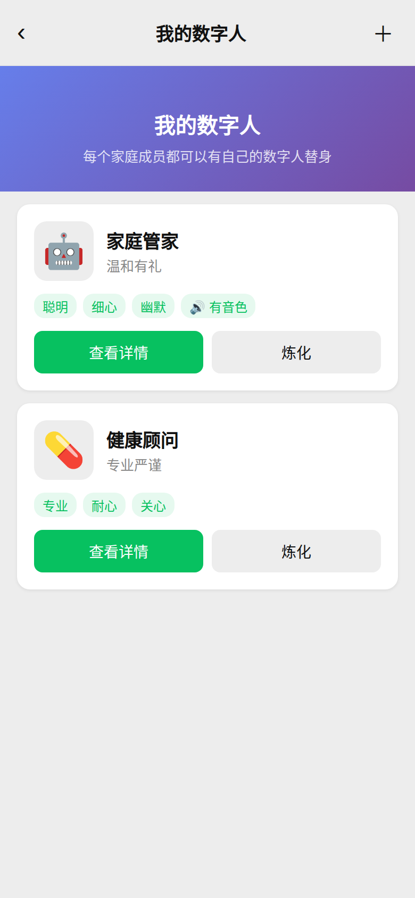

### 功能说明

| 特性 | 说明 |
|------|------|
| **独立灵魂** | 每个数字人有独立的价值观、信条、情感模式 |
| **独立身份** | 姓名、年龄、职业、家庭角色 |
| **独立性格** | 性格特质、说话风格、口头禅、幽默风格 |
| **独立记忆** | 短期/长期/核心/情景记忆系统 |
| **情绪变化** | 根据聊天内容自动变化情绪 |
| **专属音色** | 可分配独立的语音音色 |

### 创建数字人

点击右上角 ＋ 按钮：

| 字段 | 说明 | 必填 |
|------|------|------|
| 名称 | 数字人名字（如：老爸、老妈） | ✅ |
| 头像 | 选择 emoji 头像 | ✅ |
| 家庭角色 | 爸爸/妈妈/儿子/女儿等 | ❌ |
| 背景故事 | 数字人的背景描述 | ❌ |
| 说话风格 | 温柔/幽默/严肃等 | ❌ |

### 炼化数字人（增强版）

升级后的炼化系统支持四种输入方式：

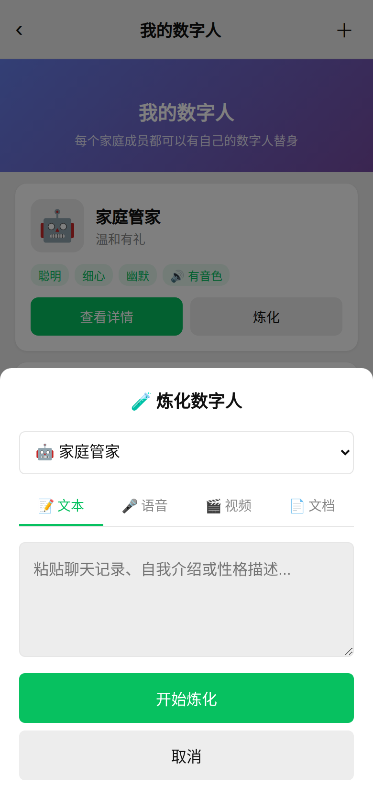

| 方式 | 说明 | 支持格式 |
|------|------|----------|
| 📝 文本 | 粘贴聊天记录或自我介绍 | 纯文本 |
| 🎤 语音 | 上传音频文件，自动转录并提取性格 | mp3, wav, m4a 等 |
| 🎬 视频 | 上传视频，提取音频+转录+性格 | mp4, mov, avi 等 |
| 📄 文档 | 上传文档，解析内容并提取性格 | txt, pdf, docx, xlsx, md, json |

---

## 18. 语音音色管理

为每个数字人配置专属声音，让数字人能用语音说话。

### 创建音色

支持两种方式：

**预设音色** — 从 12 种内置声音中选择：

| 音色 | 性别 | 风格 |
|------|------|------|
| 晓晓 | 女 | 温柔 |
| 云希 | 男 | 稳重 |
| 晓艺 | 女 | 年长 |
| 云健 | 男 | 活力 |
| 晓辰 | 女 | 甜美 |
| 晓墨 | 女 | 知性 |
| 云扬 | 男 | 新闻 |
| 晓萱 | 女 | 活力 |
| 晓涵 | 女 | 温暖 |
| 云枫 | 男 | 磁性 |
| 晓梦 | 女 | 萌系 |
| 云泽 | 男 | 成熟 |

**上传克隆** — 上传音频文件，系统自动分析音色特征并匹配最接近的声音。

### 分配音色

将创建好的音色分配给数字人，数字人在群聊中回复时会自动使用该音色合成语音消息。

---

> 📖 本手册覆盖 FamilyChat v3.0.0 全部功能。如有疑问，请联系系统管理员。
